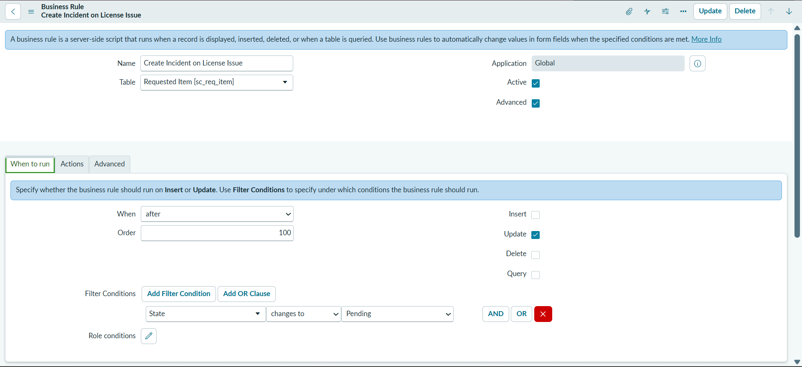
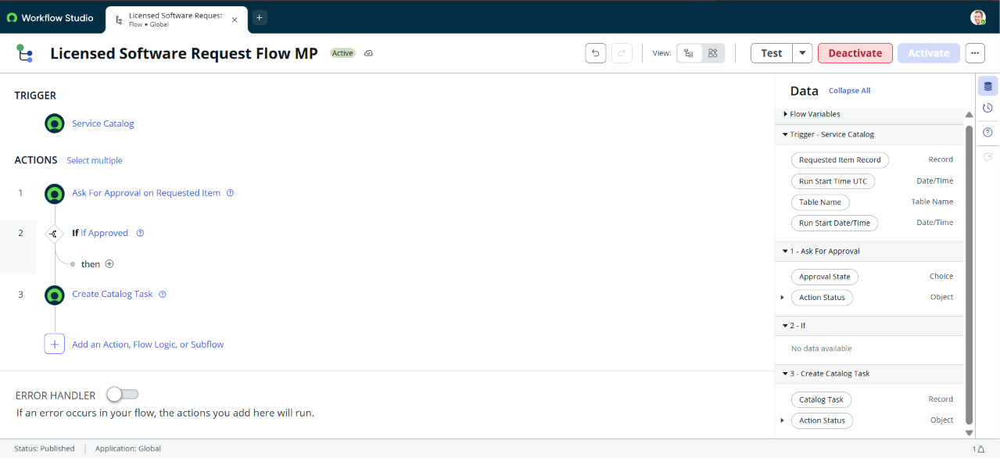

# Phase 2: Backend Development & Configurations Data Architecture

This folder contains all documentation, configurations, and deliverables completed for Phase 2.

---

## Subtasks & Deliverables

### 1. Data Architecture
- **Description:** Defined foundational table structures, core fields, and data schema relationships for the licensed software request process.
- **Deliverable:** `data_architecture.png`

---

### 2. Business Rules
- **Description:** Configured server-side Business Rules on the Requested Item (`sc_req_item`) table triggered when a request moves into the `Pending` state.
- **Deliverable:** `business_rule_config.png`

---

### 3. Automation Logic
- **Description:** Process automation constructed in ServiceNow Flow Designer. Handles automatic manager approvals upon submission and generates fulfillment catalog tasks for assignment groups.
- **Deliverable:** `automation_flow_design.png`

