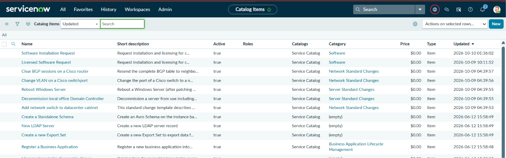
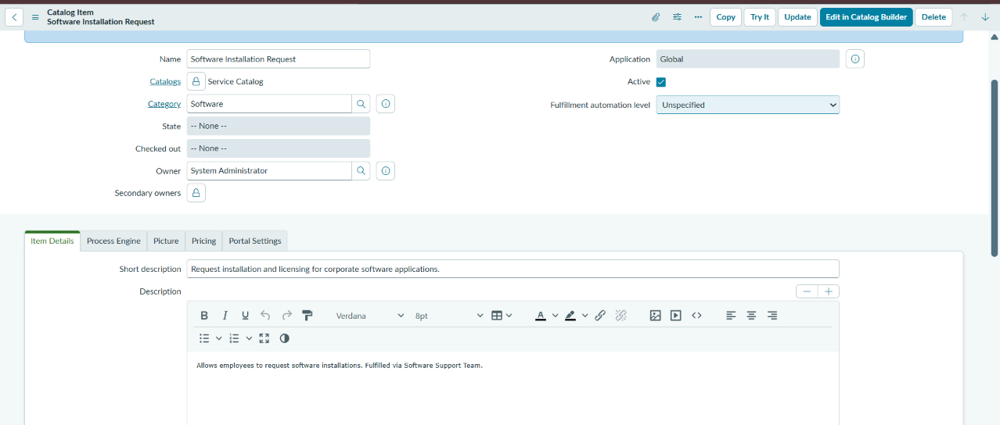
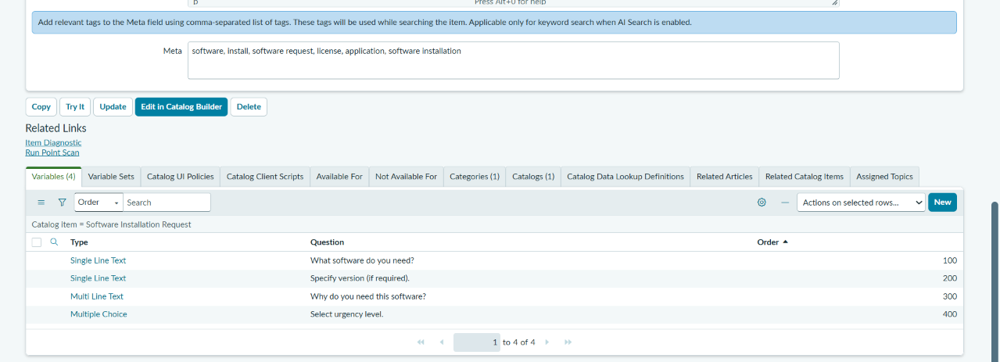
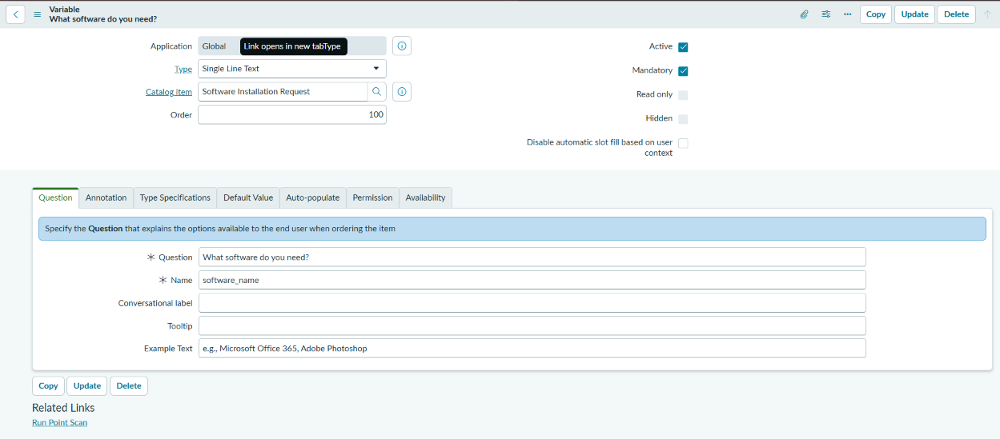
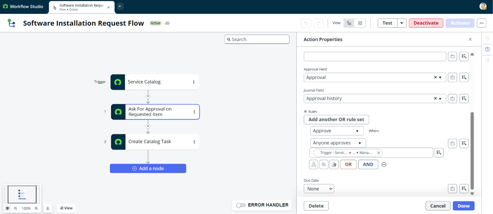
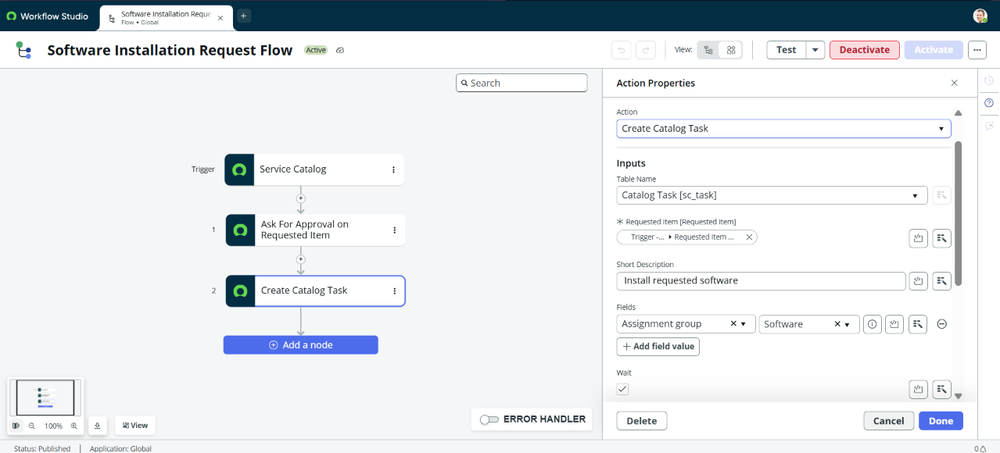
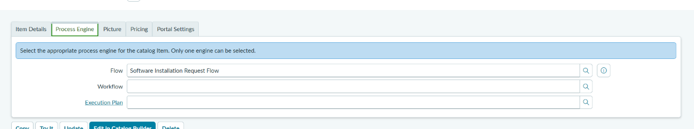
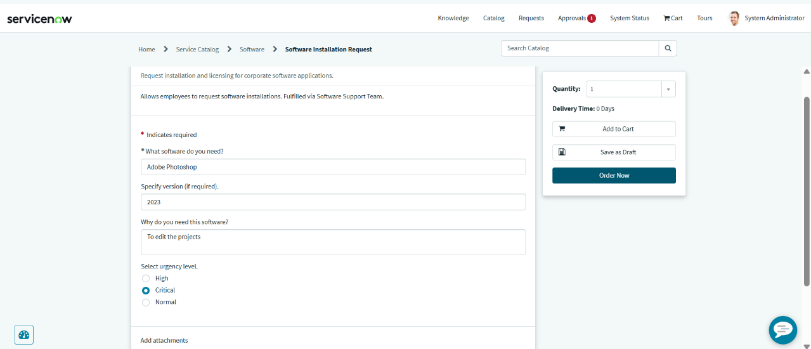
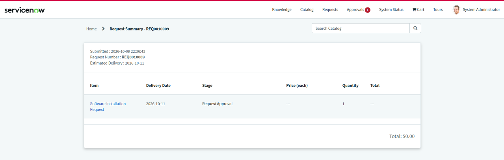
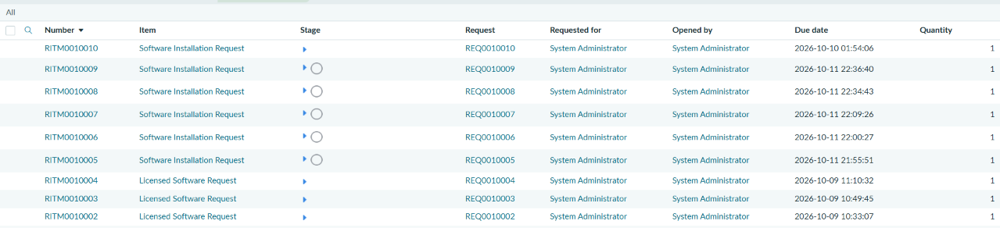

# Setup & Recreation Manual: Software Installation Request

This document provides a step-by-step manual for recreating the **Software Installation Request** catalog item, variables, Flow Designer workflow, process engine binding, and test submission in a ServiceNow Personal Developer Instance (PDI).

---

## Step 1: Catalog Item Table Verification
Navigate to **Service Catalog > Catalog Definitions > Maintain Items** (`sc_cat_item.list`) to view the list of existing catalog items before creating a new definition.

1. Open the filter navigator and type `sc_cat_item.list`.
2. Verify that the catalog item list loads properly.

---

## Step 2: Catalog Item Creation & Details
Create and configure the main Catalog Item definition:

1. Click **New** at the top of the Catalog Items list.
2. Fill out the following fields:
   - **Name:** Software Installation Request
   - **Catalogs:** Service Catalog
   - **Category:** Software
   - **Short Description:** Request installation and licensing for corporate software applications.
   - **Description:** Allows employees to request software installations. Fulfilled via Software Support Team.
3. Click **Submit** or **Save**.

---

## Step 3: Variable List Configuration
Scroll down to the **Variables** related list at the bottom of your newly created Catalog Item form to define user inputs:

1. Locate the **Variables** tab in the related lists.
2. Click **New** to create each required input variable.

---

## Step 4: Variable Setup Details
Configure individual variable properties (e.g., `software_name`):

1. **Type:** Single Line Text
2. **Question:** What software do you need?
3. **Name:** software_name
4. **Mandatory:** Checked (`true`)
5. Save the variable and repeat for remaining fields (`software_version`, `business_justification`, and `urgency_level`).

---

## Step 5: Flow Designer Workflow Creation
Navigate to **Workflow Studio / Flow Designer** and build the automation flow:

1. Go to **Process Automation > Flow Designer**.
2. Click **New > Flow** and name it **Software Installation Request Flow**.
3. Set **Trigger** to **Service Catalog**.
4. Add **Action 1:** Ask For Approval on Requested Item (`sc_req_item`).
5. Add **Action 2:** Create Catalog Task (`sc_task`).

---

## Step 6: Catalog Task Field Mapping
Configure the **Create Catalog Task** action inside Flow Designer:

1. Expand Action 2 (**Create Catalog Task**).
2. Set **Table** to `Catalog Task [sc_task]`.
3. Set **Fulfillment Group** to `Software Support`.
4. Map input variables (`software_name`, `business_justification`, etc.) from the trigger data pill into the Task Description / Work Notes.
5. Save and **Activate** the flow.

---

## Step 7: Linking Flow to Catalog Item
Link the published flow to the Catalog Item definition in ServiceNow backend:

1. Navigate back to **Service Catalog > Catalog Definitions > Maintain Items**.
2. Open **Software Installation Request**.
3. Click the **Process Engine** tab.
4. In the **Flow** field, search and select **Software Installation Request Flow**.
5. Click **Update**.

---

## Step 8: End-User Request via Service Portal
Perform end-to-end user acceptance testing from the Service Portal:

1. Go to your portal URL: `https://<instance>.service-now.com/sp`.
2. Search for and open **Software Installation Request**.
3. Fill out the request form:
   - **What software do you need?** Adobe Photoshop
   - **Specify version:** 2023
   - **Why do you need this software?** To edit the projects
   - **Select urgency level:** Critical

---

## Step 9: Order Confirmation Screen
Submit the order and confirm the generated Request Number:

1. Click **Order Now**.
2. Capture the submission confirmation screen displaying the generated **Request Number (REQ)**.

---

## Step 10: Backend Record Verification (`RITM` & `SCTASK`)
Verify record creation in the backend instance:

1. Return to the main ServiceNow platform interface.
2. Navigate to **Service Catalog > Open Records > Requested Items** (`sc_req_item.list`).
3. Confirm that the new `RITM` record and linked catalog fulfillment task (`SCTASK`) were generated automatically by the flow.

